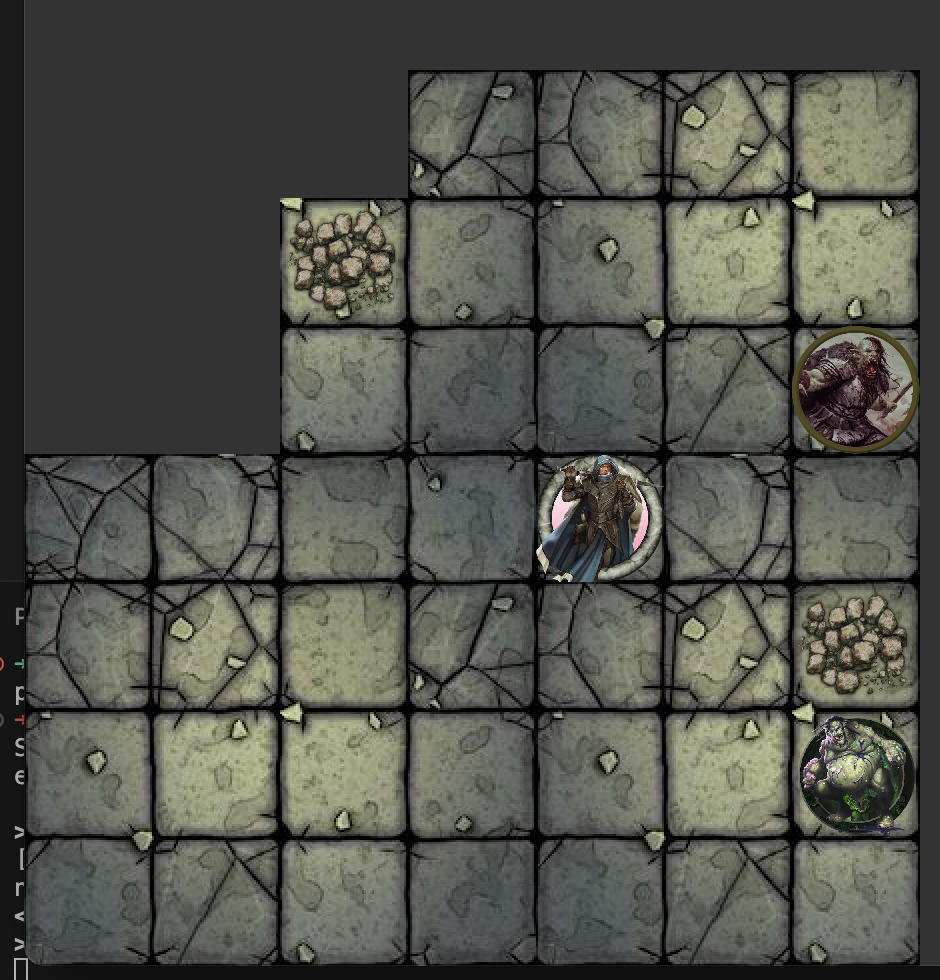

# Board game example using libGDX Java library

This is an example POC how to create board game using libGDX Java library.
This game is turn based, inspired by simple DnD game play.

Player is a hero in fixed game space facing monsters that will try to chase and attack him.
Movement is done using W A S D keys and attack nearby monster is done with O key. 
End turn is done with Space.

Game have some beginner UI, but as POC it enough to start with. Sound effects on hit and death are added and also
some intensive background music.

Gameplay already have hero movement, obstacle block and support for multiple monsters. Code can scale for bigger game board.


## Installation
Clone the repository into local folder and follow the instructions.

To build a game run this command
```bash
./gradlew build
```

To run the game run gradle run.
```bash
./gradlew run
```
Have fun! :)

