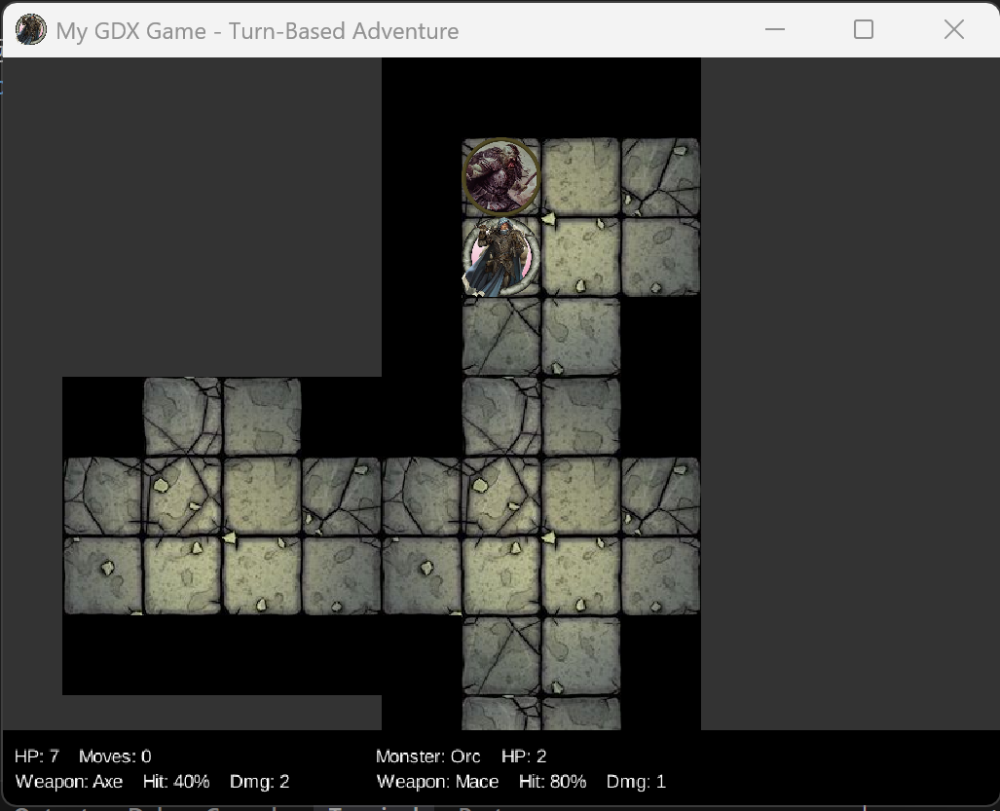

# Turn-Based Dungeon Crawler

A turn-based dungeon crawler built with libGDX, inspired by classic DnD gameplay. Explore procedurally generated dungeons, fight monsters, collect weapons, and survive.



## Features

- **Procedural dungeon generation** — room-based maze with fog of war exploration
- **Turn-based combat** — hit chance and damage system with multiple weapon types
- **Monster AI** — BFS pathfinding, monsters chase and attack when in range
- **Inventory system** — collect and switch between weapons mid-game
- **Multiple monster types** — Trolls, Orcs, and Werewolves with unique stats
- **Sound effects** — hit, death, and background music
- **Toast notifications** — in-game combat and event feedback

## Controls

| Key | Action |
|-----|--------|
| `W` `A` `S` `D` | Move hero |
| `U` | Attack adjacent monster |
| `I` | Switch weapon |
| `Space` | End turn |

## Monsters

| Monster | HP | Speed | Weapon | Hit Chance | Damage |
|---------|----|-------|--------|------------|--------|
| Troll | 2 | 4 | Big Club | 50% | 2 |
| Orc | 2 | 5 | Mace | 80% | 1 |
| Werewolf | 1 | 6 | Bite | 75% | 1 |

## Hero Weapons

| Weapon | Hit Chance | Damage |
|--------|------------|--------|
| Sword | 75% | 1 |
| Axe | 40% | 2 |

## Tech Stack

- **libGDX** 1.14.0
- **Java** 11
- **Gradle** 8.10 (multi-module)
- **LWJGL3** desktop backend

## Project Structure

```
mygdx/
├── core/src/com/mygdx/game/   # Shared game logic (platform-agnostic)
│   ├── MyGdxGame.java         # Main game loop (create/render/dispose)
│   ├── GameBoard.java         # Board state, turns, exploration
│   ├── Hero.java              # Player character, inventory, movement
│   ├── Monster.java           # Enemy AI with BFS pathfinding
│   ├── Creature.java          # Base class for Hero and Monster
│   ├── Weapon.java            # Abstract weapon (Sword, Axe, Mace, BigClub, Bite)
│   ├── Item.java              # Abstract base for collectibles
│   ├── Square.java            # Board tile with texture and state
│   ├── Position.java          # 2D coordinate value object
│   ├── RoomMazeGenerator.java # Procedural dungeon generation
│   ├── RandomMonsterFactory.java # Monster factory
│   ├── MyInputAdapter.java    # Keyboard input handling
│   ├── Toast.java             # In-game notifications
│   └── AudioConfig.java       # Audio volume settings
├── desktop/src/               # Desktop launcher (LWJGL3)
├── assets/                    # Textures, sounds, fonts
├── build.gradle               # Root build config
├── settings.gradle            # Module includes (desktop, core)
└── AGENTS.md                  # AI coding assistant instructions
```

## Prerequisites

- **JDK 21** or newer
- **Gradle** (wrapper included, no separate install needed)

## Getting Started

Clone the repository:

```bash
git clone https://github.com/your-username/mygdx.git
cd mygdx
```

Build the project:

```bash
./gradlew build
```

Run the game:

```bash
./gradlew :desktop:run
```

Build a distributable JAR:

```bash
./gradlew :desktop:dist
```

The JAR will be in `desktop/build/libs/`.

## How It Works

The game generates a 32x32 tile dungeon composed of 8x8 rooms (4x4 tiles each). The hero starts in one room and explores by moving into unexplored tiles, which reveals the room and may spawn monsters. Each turn the hero can move (up to 8 tiles) and attack. After ending the turn, all active monsters take theirs — moving toward the hero using BFS pathfinding and attacking if adjacent.

## License

This project is a proof of concept for learning libGDX game development.
